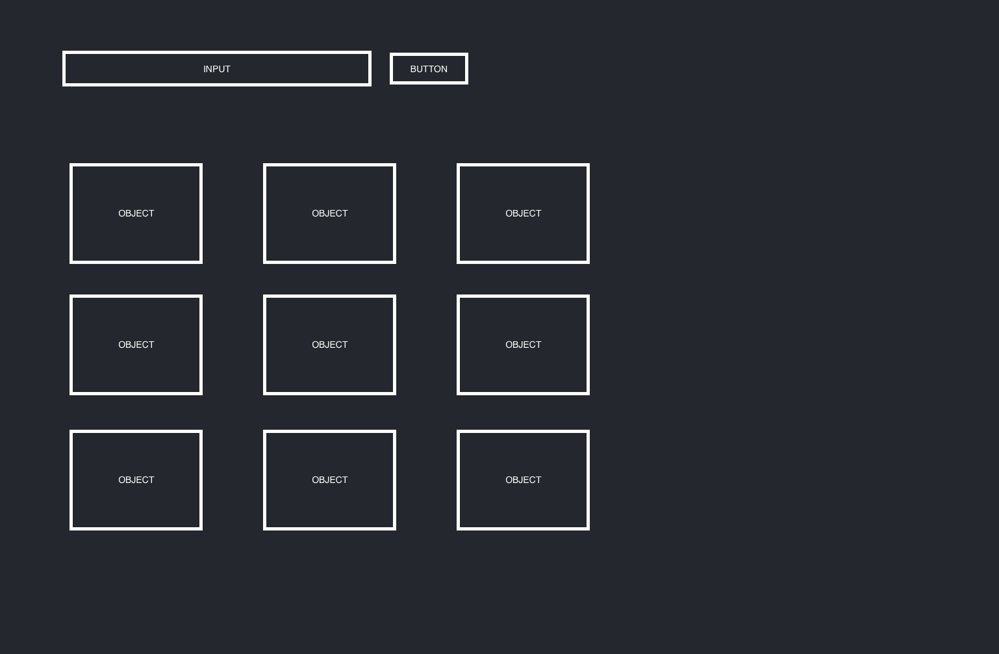

# HTML

-   dropdown menu
-   button
-   section for objects

# STATE

-   array of objects from database
-   array of objects.attributes from database

# EVENTS

-   request arrays from database on load

    -   append objects to section
        -append objects.attributes to dropdown

-   filter objects by chosen attribute on submit
    -   display new list

# SLICES

-   Slice 1) display list of objects on load
-   Slice 2) append object attributes to dropdown
-   Slice 3) filter objects on submit
